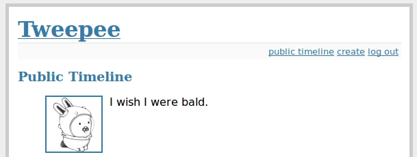
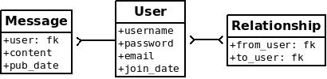

.. _example-app:

Example app
===========

We'll be building a simple *twitter*-like site. The source code for the example can be found in the ``examples/twitter`` directory. You can also `browse the source-code <https://github.com/coleifer/peewee/tree/master/examples/twitter>`_ on github. There is also an example `blog app <https://github.com/coleifer/peewee/tree/master/examples/blog>`_ if that's more to your liking.

The example app uses the `flask <http://flask.pocoo.org/>`_ web framework which is very easy to get started with. If you don't have flask already, you will need to install it to run the example:

.. code-block:: console

    pip install flask

Running the example
-------------------

After ensuring that flask is installed, ``cd`` into the twitter example directory and execute the ``run_example.py`` script:

.. code-block:: console

    python run_example.py

The example app will be accessible at http://localhost:5000/

Diving into the code
--------------------

For simplicity all example code is contained within a single module, ``examples/twitter/app.py``. For a guide on structuring larger Flask apps with peewee, check out `Structuring Flask Apps <http://charlesleifer.com/blog/structuring-flask-apps-a-how-to-for-those-coming-from-django/>`_.

.. _example-app-models:

Models
^^^^^^

In the spirit of the popular web framework Django, peewee uses declarative model definitions. If you're not familiar with Django, the idea is that you declare a model class for each table. The model class then defines one or more field attributes which correspond to the table's columns. For the twitter clone, there are just three models:

*User*:
    Represents a user account and stores the username and password, an email
    address for generating avatars using *gravatar*, and a datetime field
    indicating when that account was created.

*Relationship*:
    This is a utility model that contains two foreign-keys to
    the *User* model and stores which users follow one another.

*Message*:
    Analagous to a tweet. The Message model stores the text content of
    the tweet, when it was created, and who posted it (foreign key to User).

If you like UML, these are the tables and relationships:

In order to create these models we need to instantiate a :py:class:`SqliteDatabase` object. Then we define our model classes, specifying the columns as :py:class:`Field` instances on the class.

.. code-block:: python

    # create a peewee database instance -- our models will use this database to
    # persist information
    database = SqliteDatabase(DATABASE)

    # model definitions -- the standard "pattern" is to define a base model class
    # that specifies which database to use.  then, any subclasses will automatically
    # use the correct storage.
    class BaseModel(Model):
        class Meta:
            database = database

    # the user model specifies its fields (or columns) declaratively, like django
    class User(BaseModel):
        username = CharField(unique=True)
        password = CharField()
        email = CharField()
        join_date = DateTimeField()

        class Meta:
            order_by = ('username',)

    # this model contains two foreign keys to user -- it essentially allows us to
    # model a "many-to-many" relationship between users.  by querying and joining
    # on different columns we can expose who a user is "related to" and who is
    # "related to" a given user
    class Relationship(BaseModel):
        from_user = ForeignKeyField(User, related_name='relationships')
        to_user = ForeignKeyField(User, related_name='related_to')

        class Meta:
            indexes = (
                # Specify a unique multi-column index on from/to-user.
                (('from_user', 'to_user'), True),
            )

    # a dead simple one-to-many relationship: one user has 0..n messages, exposed by
    # the foreign key.  because we didn't specify, a users messages will be accessible
    # as a special attribute, User.message_set
    class Message(BaseModel):
        user = ForeignKeyField(User)
        content = TextField()
        pub_date = DateTimeField()

        class Meta:
            order_by = ('-pub_date',)

.. note::
    Note that we create a *BaseModel* class that simply defines what database
    we would like to use.  All other models then extend this class and will also
    use the correct database connection.

Peewee supports many different :ref:`field types <fields>` which map to different column types commonly supported by database engines.  Conversion between python types and those used in the database is handled transparently, allowing you to use the following in your application:

* Strings (unicode or otherwise)
* Integers, floats, and ``Decimal`` numbers.
* Boolean values
* Dates, times and datetimes
* ``None`` (NULL)
* Binary data

Creating tables
^^^^^^^^^^^^^^^

In order to start using the models, its necessary to create the tables. This is a one-time operation and can be done quickly using the interactive interpreter. We can create a small helper function to accomplish this:

.. code-block:: python

    def create_tables():
        database.connect()
        database.create_tables([User, Relationship, Message])

Open a python shell in the directory alongside the example app and execute the
following:

.. code-block:: python

    >>> from app import *
    >>> create_tables()

.. note::
    If you encounter an *ImportError* it means that either *flask* or *peewee*
    was not found and may not be installed correctly. Check the :ref:`installation`
    document for instructions on installing peewee.

Every model has a :py:meth:`~Model.create_table` classmethod which runs a SQL *CREATE TABLE* statement in the database. This method will create the table, including all columns, foreign-key constraints, indexes, and sequences. Usually this is something you'll only do once, whenever a new model is added.

Peewee provides a helper method :py:meth:`Database.create_tables` which will resolve inter-model dependencies and call :py:meth:`~Model.create_table` on each model.

.. note::
    Adding fields after the table has been created will required you to
    either drop the table and re-create it or manually add the columns
    using an *ALTER TABLE* query.

    Alternatively, you can use the :ref:`schema migrations <migrate>` extension
    to alter your database schema using Python.

.. note::
    You can also write ``database.create_tables([User, ...], True)`` and peewee will first check to see if the table exists before creating it.

Establishing a database connection
^^^^^^^^^^^^^^^^^^^^^^^^^^^^^^^^^^

You may have noticed in the above model code that there is a class defined on the base model named *Meta* that sets the ``database`` attribute. Peewee allows every model to specify which database it uses. There are many :ref:`Meta options <model-options>` you can specify which control the behavior of your model.

This is a peewee idiom:

.. code-block:: python

    DATABASE = 'tweepee.db'

    # Create a database instance that will manage the connection and
    # execute queries
    database = SqliteDatabase(DATABASE, threadlocals=True)

When developing a web application, it's common to open a connection when a request starts, and close it when the response is returned. **You should always manage your connections explicitly**. For instance, if you are using a :ref:`connection pool <pool>`, connections will only be recycled correctly if you call :py:meth:`~Database.connect` and :py:meth:`~Database.close`.

We will tell flask that during the request/response cycle we need to create a connection to the database. Flask provides some handy decorators to make this a snap:

.. code-block:: python

    @app.before_request
    def before_request():
        database.connect()
       
    @app.after_request
    def after_request(response):
        database.close()
        return response

.. note::
    Peewee uses thread local storage to manage connection state, so this pattern can be used with multi-threaded WSGI servers.

Making queries
^^^^^^^^^^^^^^

In the *User* model there are a few instance methods that encapsulate some user-specific functionality:

* ``following()``: who is this user following?
* ``followers()``: who is following this user?

These methods are similar in their implementation but with an important difference in the SQL *JOIN* and *WHERE* clauses:

.. code-block:: python

    def following(self):
        # query other users through the "relationship" table
        return (User
                .select()
                .join(Relationship, on=Relationship.to_user)
                .where(Relationship.from_user == self))

    def followers(self):
        return (User
                .select()
                .join(Relationship, on=Relationship.from_user)
                .where(Relationship.to_user == self))

Creating new objects
^^^^^^^^^^^^^^^^^^^^

When a new user wants to join the site we need to make sure the username is available, and if so, create a new *User* record. Looking at the *join()* view, we can that our application attempts to create the User using :py:meth:`Model.create`. We defined the *User.username* field with a unique constraint, so if the username is taken the database will raise an ``IntegrityError``.

.. code-block:: python

    try:
        with database.transaction():
            # Attempt to create the user. If the username is taken, due to the
            # unique constraint, the database will raise an IntegrityError.
            user = User.create(
                username=request.form['username'],
                password=md5(request.form['password']).hexdigest(),
                email=request.form['email'],
                join_date=datetime.datetime.now()
            )

        # mark the user as being 'authenticated' by setting the session vars
        auth_user(user)
        return redirect(url_for('homepage'))

    except IntegrityError:
        flash('That username is already taken')

We will use a similar approach when a user wishes to follow someone. To indicate a following relationship, we create a row in the *Relationship* table pointing from one user to another. Due to the unique index on ``from_user`` and ``to_user``, we will be sure not to end up with duplicate rows:

.. code-block:: python

    user = get_object_or_404(User, username=username)
    try:
        with database.transaction():
            Relationship.create(
                from_user=get_current_user(),
                to_user=user)
    except IntegrityError:
        pass

Performing subqueries
^^^^^^^^^^^^^^^^^^^^^

If you are logged-in and visit the twitter homepage, you will see tweets from the users that you follow. In order to implement this cleanly, we can use a subquery:

.. code-block:: python

    # python code
    messages = Message.select().where(Message.user << user.following())

This code corresponds to the following SQL query:

.. code-block:: sql

    SELECT t1."id", t1."user_id", t1."content", t1."pub_date"
    FROM "message" AS t1
    WHERE t1."user_id" IN (
        SELECT t2."id"
        FROM "user" AS t2
        INNER JOIN "relationship" AS t3
            ON t2."id" = t3."to_user_id"
        WHERE t3."from_user_id" = ?
    )

Other topics of interest
^^^^^^^^^^^^^^^^^^^^^^^^

There are a couple other neat things going on in the example app that are worth mentioning briefly.

* Support for paginating lists of results is implemented in a simple function called
  ``object_list`` (after it's corollary in Django).  This function is used by all
  the views that return lists of objects.

  .. code-block:: python

      def object_list(template_name, qr, var_name='object_list', **kwargs):
          kwargs.update(
              page=int(request.args.get('page', 1)),
              pages=qr.count() / 20 + 1
          )
          kwargs[var_name] = qr.paginate(kwargs['page'])
          return render_template(template_name, **kwargs)

* Simple authentication system with a ``login_required`` decorator.  The first
  function simply adds user data into the current session when a user successfully
  logs in.  The decorator ``login_required`` can be used to wrap view functions,
  checking for whether the session is authenticated and if not redirecting to the
  login page.

  .. code-block:: python

      def auth_user(user):
          session['logged_in'] = True
          session['user'] = user
          session['username'] = user.username
          flash('You are logged in as %s' % (user.username))

      def login_required(f):
          @wraps(f)
          def inner(*args, **kwargs):
              if not session.get('logged_in'):
                  return redirect(url_for('login'))
              return f(*args, **kwargs)
          return inner

* Return a 404 response instead of throwing exceptions when an object is not
  found in the database.

  .. code-block:: python

      def get_object_or_404(model, *expressions):
          try:
              return model.get(*expressions)
          except model.DoesNotExist:
              abort(404)

More examples
-------------

There are more examples included in the peewee `examples directory <https://github.com/coleifer/peewee/blob/master/examples/>`_, including:

* `Example blog app <https://github.com/coleifer/peewee/tree/master/examples/blog>`_ using Flask and peewee. Also see `accompanying blog post <http://charlesleifer.com/blog/how-to-make-a-flask-blog-in-one-hour-or-less/>`_.
* `An encrypted command-line diary <https://github.com/coleifer/peewee/blob/master/examples/diary.py>`_. There is a `companion blog post <http://charlesleifer.com/blog/dear-diary-an-encrypted-command-line-diary-with-python/>`_ you might enjoy as well.
* `Analytics web-service <https://github.com/coleifer/peewee/tree/master/examples/analytics>`_ (like a lite version of Google Analytics). Also check out the `companion blog post <http://charlesleifer.com/blog/saturday-morning-hacks-building-an-analytics-app-with-flask/>`_.

.. note::
    Like these snippets and interested in more?  Check out `flask-peewee <https://github.com/coleifer/flask-peewee>`_ -
    a flask plugin that provides a django-like Admin interface, RESTful API, Authentication and
    more for your peewee models.
