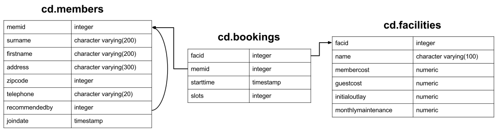

.. _query-library:

Query Examples Library
======================

These query examples are taken from the site `Postgresql Exercises
<https://pgexercises.com/>`_. A sample data-set can be found on the `getting
started page <https://pgexercises.com/gettingstarted.html>`__.

Direct download: `clubdata.sql <https://raw.githubusercontent.com/coleifer/peewee/refs/heads/master/docs/clubdata.sql>`__

.. contents:: On this page
   :local:
   :depth: 1

Model Definitions
-----------------

Here is a visual representation of the schema used in these examples:

To begin working with the data, we'll define the model classes that correspond
to the tables in the diagram.

.. note::
    In some cases we explicitly specify column names for a particular field.
    This is so our models are compatible with the database schema used for the
    postgres exercises.

.. code-block:: python

    from functools import partial
    from peewee import *

    db = PostgresqlDatabase('peewee_test')

    class BaseModel(Model):
        class Meta:
            database = db

    class Member(BaseModel):
        memid = AutoField()  # Auto-incrementing primary key.
        surname = CharField()
        firstname = CharField()
        address = CharField(max_length=300)
        zipcode = IntegerField()
        telephone = CharField()
        recommendedby = ForeignKeyField('self', backref='recommended',
                                        column_name='recommendedby', null=True)
        joindate = DateTimeField()

        class Meta:
            table_name = 'members'

    # Conveniently declare decimal fields suitable for storing currency.
    MoneyField = partial(DecimalField, decimal_places=2)

    class Facility(BaseModel):
        facid = AutoField()
        name = CharField()
        membercost = MoneyField()
        guestcost = MoneyField()
        initialoutlay = MoneyField()
        monthlymaintenance = MoneyField()

        class Meta:
            table_name = 'facilities'

    class Booking(BaseModel):
        bookid = AutoField()
        facility = ForeignKeyField(Facility, column_name='facid')
        member = ForeignKeyField(Member, column_name='memid')
        starttime = DateTimeField()
        slots = IntegerField()

        class Meta:
            table_name = 'bookings'

Schema Creation
---------------

If you downloaded the SQL file from the Postgresql Exercises site, then you can
load the data into a Postgresql database using the following commands::

    createdb peewee_test
    psql -U postgres -f clubdata.sql -d peewee_test -x -q

To create the schema using Peewee, without loading the sample data, you can run
the following:

.. code-block:: python

    # Assumes you have created the database "peewee_test" already.
    db.create_tables([Member, Facility, Booking])

Basic Exercises
---------------

This category deals with the basics of SQL. It covers select and where clauses,
case expressions, unions, and a few other odds and ends.

Retrieve everything
^^^^^^^^^^^^^^^^^^^

Retrieve all information from facilities table.

.. code-block:: sql

    SELECT * FROM facilities

.. code-block:: python

    # By default, when no fields are explicitly passed to select(), all fields
    # will be selected.
    query = Facility.select()

Retrieve specific columns from a table
^^^^^^^^^^^^^^^^^^^^^^^^^^^^^^^^^^^^^^

Retrieve names of facilities and cost to members.

.. code-block:: sql

    SELECT name, membercost FROM facilities;

.. code-block:: python

    query = Facility.select(Facility.name, Facility.membercost)

    # To iterate:
    for facility in query:
        print(facility.name)

Control which rows are retrieved
^^^^^^^^^^^^^^^^^^^^^^^^^^^^^^^^

Retrieve list of facilities that have a cost to members.

.. code-block:: sql

    SELECT * FROM facilities WHERE membercost > 0

.. code-block:: python

    query = Facility.select().where(Facility.membercost > 0)

Control which rows are retrieved - part 2
^^^^^^^^^^^^^^^^^^^^^^^^^^^^^^^^^^^^^^^^^

Retrieve list of facilities that have a cost to members, and that fee is less
than 1/50th of the monthly maintenance cost. Return id, name, cost and
monthly-maintenance.

.. code-block:: sql

    SELECT facid, name, membercost, monthlymaintenance
    FROM facilities
    WHERE membercost > 0 AND membercost < (monthlymaintenance / 50)

.. code-block:: python

    query = (Facility
             .select(Facility.facid, Facility.name, Facility.membercost,
                     Facility.monthlymaintenance)
             .where(
                 (Facility.membercost > 0) &
                 (Facility.membercost < (Facility.monthlymaintenance / 50))))

Basic string searches
^^^^^^^^^^^^^^^^^^^^^^^^^^^^^^^^

How can you produce a list of all facilities with the word 'Tennis' in their
name?

.. code-block:: sql

    SELECT * FROM facilities WHERE name ILIKE '%tennis%';

.. code-block:: python

    query = Facility.select().where(Facility.name.contains('tennis'))

    # OR use the exponent operator. Note: you must include wildcards here:
    query = Facility.select().where(Facility.name ** '%tennis%')

Matching against multiple possible values
^^^^^^^^^^^^^^^^^^^^^^^^^^^^^^^^^^^^^^^^^

How can you retrieve the details of facilities with ID 1 and 5? Try to do it
without using the OR operator.

.. code-block:: sql

    SELECT * FROM facilities WHERE facid IN (1, 5);

.. code-block:: python

    query = Facility.select().where(Facility.facid.in_([1, 5]))

    # OR:
    query = Facility.select().where((Facility.facid == 1) |
                                    (Facility.facid == 5))

Classify results into buckets
^^^^^^^^^^^^^^^^^^^^^^^^^^^^^^^^

How can you produce a list of facilities, with each labelled as 'cheap' or
'expensive' depending on if their monthly maintenance cost is more than $100?
Return the name and monthly maintenance of the facilities in question.

.. code-block:: sql

    SELECT name,
    CASE WHEN monthlymaintenance > 100 THEN 'expensive' ELSE 'cheap' END
    FROM facilities;

.. code-block:: python

    cost = Case(None, [(Facility.monthlymaintenance > 100, 'expensive')], 'cheap')
    query = Facility.select(Facility.name, cost.alias('cost'))

.. note:: See documentation :class:`Case` for more examples.

Working with dates
^^^^^^^^^^^^^^^^^^^^^^^^^^^^^^^^

How can you produce a list of members who joined after the start of September
2012? Return the memid, surname, firstname, and joindate of the members in
question.

.. code-block:: sql

    SELECT memid, surname, firstname, joindate FROM members
    WHERE joindate >= '2012-09-01';

.. code-block:: python

    query = (Member
             .select(Member.memid, Member.surname, Member.firstname, Member.joindate)
             .where(Member.joindate >= datetime.date(2012, 9, 1)))

Removing duplicates, and ordering results
^^^^^^^^^^^^^^^^^^^^^^^^^^^^^^^^^^^^^^^^^

How can you produce an ordered list of the first 10 surnames in the members
table? The list must not contain duplicates.

.. code-block:: sql

    SELECT DISTINCT surname FROM members ORDER BY surname LIMIT 10;

.. code-block:: python

    query = (Member
             .select(Member.surname)
             .order_by(Member.surname)
             .limit(10)
             .distinct())

Combining results from multiple queries
^^^^^^^^^^^^^^^^^^^^^^^^^^^^^^^^^^^^^^^^^

You, for some reason, want a combined list of all surnames and all facility
names.

.. code-block:: sql

    SELECT surname FROM members UNION SELECT name FROM facilities;

.. code-block:: python

    lhs = Member.select(Member.surname)
    rhs = Facility.select(Facility.name)
    query = lhs | rhs

Queries can be composed using the following operators:

* ``|`` - ``UNION``
* ``+`` - ``UNION ALL``
* ``&`` - ``INTERSECT``
* ``-`` - ``EXCEPT``

Simple aggregation
^^^^^^^^^^^^^^^^^^^^^^^^^^^^^^^^

You'd like to get the signup date of your last member. How can you retrieve
this information?

.. code-block:: sql

    SELECT MAX(join_date) FROM members;

.. code-block:: python

    query = Member.select(fn.MAX(Member.joindate))
    # To conveniently obtain a single scalar value, use "scalar()":
    # max_join_date = query.scalar()

More aggregation
^^^^^^^^^^^^^^^^^^^^^^^^^^^^^^^^

You'd like to get the first and last name of the last member(s) who signed up
- not just the date.

.. code-block:: sql

    SELECT firstname, surname, joindate FROM members
    WHERE joindate = (SELECT MAX(joindate) FROM members);

.. code-block:: python

    # Use "alias()" to reference the same table multiple times in a query.
    MemberAlias = Member.alias()
    subq = MemberAlias.select(fn.MAX(MemberAlias.joindate))
    query = (Member
             .select(Member.firstname, Member.surname, Member.joindate)
             .where(Member.joindate == subq))

Joins and Subqueries
--------------------

This category deals primarily with a foundational concept in relational
database systems: joining. Joining allows you to combine related information
from multiple tables to answer a question. This isn't just beneficial for ease
of querying: a lack of join capability encourages denormalisation of data,
which increases the complexity of keeping your data internally consistent.

This topic covers inner, outer, and self joins, as well as spending a little
time on subqueries (queries within queries).

Retrieve the start times of members' bookings
^^^^^^^^^^^^^^^^^^^^^^^^^^^^^^^^^^^^^^^^^^^^^^^^^^

How can you produce a list of the start times for bookings by members named
'David Farrell'?

.. code-block:: sql

    SELECT starttime FROM bookings
    INNER JOIN members ON (bookings.memid = members.memid)
    WHERE surname = 'Farrell' AND firstname = 'David';

.. code-block:: python

    query = (Booking
             .select(Booking.starttime)
             .join(Member)
             .where((Member.surname == 'Farrell') &
                    (Member.firstname == 'David')))

Work out the start times of bookings for tennis courts
^^^^^^^^^^^^^^^^^^^^^^^^^^^^^^^^^^^^^^^^^^^^^^^^^^^^^^^^^^^

How can you produce a list of the start times for bookings for tennis courts,
for the date '2012-09-21'? Return a list of start time and facility name
pairings, ordered by the time.

.. code-block:: sql

    SELECT starttime, name
    FROM bookings
    INNER JOIN facilities ON (bookings.facid = facilities.facid)
    WHERE date_trunc('day', starttime) = '2012-09-21':: date
      AND name ILIKE 'tennis%'
    ORDER BY starttime, name;

.. code-block:: python

    query = (Booking
             .select(Booking.starttime, Facility.name)
             .join(Facility)
             .where(
                 (fn.date_trunc('day', Booking.starttime) == datetime.date(2012, 9, 21)) &
                 Facility.name.startswith('Tennis'))
             .order_by(Booking.starttime, Facility.name))

    # To retrieve the joined facility's name when iterating:
    for booking in query:
        print(booking.starttime, booking.facility.name)

Produce a list of all members who have recommended another member
^^^^^^^^^^^^^^^^^^^^^^^^^^^^^^^^^^^^^^^^^^^^^^^^^^^^^^^^^^^^^^^^^^^^

How can you output a list of all members who have recommended another member?
Ensure that there are no duplicates in the list, and that results are ordered
by (surname, firstname).

.. code-block:: sql

    SELECT DISTINCT m.firstname, m.surname
    FROM members AS m2
    INNER JOIN members AS m ON (m.memid = m2.recommendedby)
    ORDER BY m.surname, m.firstname;

.. code-block:: python

    MA = Member.alias()
    query = (Member
             .select(Member.firstname, Member.surname)
             .join(MA, on=(MA.recommendedby == Member.memid))
             .order_by(Member.surname, Member.firstname))

Produce a list of all members, along with their recommender
^^^^^^^^^^^^^^^^^^^^^^^^^^^^^^^^^^^^^^^^^^^^^^^^^^^^^^^^^^^

How can you output a list of all members, including the individual who
recommended them (if any)? Ensure that results are ordered by (surname,
firstname).

.. code-block:: sql

    SELECT m.firstname, m.surname, r.firstname, r.surname
    FROM members AS m
    LEFT OUTER JOIN members AS r ON (m.recommendedby = r.memid)
    ORDER BY m.surname, m.firstname

.. code-block:: python

    MA = Member.alias()
    query = (Member
             .select(Member.firstname, Member.surname, MA.firstname, MA.surname)
             .join(MA, JOIN.LEFT_OUTER, on=(Member.recommendedby == MA.memid))
             .order_by(Member.surname, Member.firstname))

    # To display the recommender's name when iterating:
    for m in query:
        print(m.firstname, m.surname)
        if m.recommendedby:
            print('  ', m.recommendedby.firstname, m.recommendedby.surname)

Produce a list of all members who have used a tennis court
^^^^^^^^^^^^^^^^^^^^^^^^^^^^^^^^^^^^^^^^^^^^^^^^^^^^^^^^^^

How can you produce a list of all members who have used a tennis court?
Include in your output the name of the court, and the name of the member
formatted as a single column. Ensure no duplicate data, and order by the
member name.

.. code-block:: sql

    SELECT DISTINCT m.firstname || ' ' || m.surname AS member, f.name AS facility
    FROM members AS m
    INNER JOIN bookings AS b ON (m.memid = b.memid)
    INNER JOIN facilities AS f ON (b.facid = f.facid)
    WHERE f.name LIKE 'Tennis%'
    ORDER BY member, facility;

.. code-block:: python

    fullname = Member.firstname + ' ' + Member.surname
    query = (Member
             .select(fullname.alias('member'), Facility.name.alias('facility'))
             .join(Booking)
             .join(Facility)
             .where(Facility.name.startswith('Tennis'))
             .order_by(fullname, Facility.name)
             .distinct())

Produce a list of costly bookings
^^^^^^^^^^^^^^^^^^^^^^^^^^^^^^^^^^^^^^^^^^^^^^^^^^

How can you produce a list of bookings on the day of 2012-09-14 which will
cost the member (or guest) more than $30? Remember that guests have different
costs to members (the listed costs are per half-hour 'slot'), and the guest
user is always ID 0. Include in your output the name of the facility, the
name of the member formatted as a single column, and the cost. Order by
descending cost, and do not use any subqueries.

.. code-block:: sql

    SELECT m.firstname || ' ' || m.surname AS member,
           f.name AS facility,
           (CASE WHEN m.memid = 0 THEN f.guestcost * b.slots
            ELSE f.membercost * b.slots END) AS cost
    FROM members AS m
    INNER JOIN bookings AS b ON (m.memid = b.memid)
    INNER JOIN facilities AS f ON (b.facid = f.facid)
    WHERE (date_trunc('day', b.starttime) = '2012-09-14') AND
     ((m.memid = 0 AND b.slots * f.guestcost > 30) OR
      (m.memid > 0 AND b.slots * f.membercost > 30))
    ORDER BY cost DESC;

.. code-block:: python

    cost = Case(Member.memid, (
        (0, Booking.slots * Facility.guestcost),
    ), (Booking.slots * Facility.membercost))
    fullname = Member.firstname + ' ' + Member.surname

    query = (Member
             .select(fullname.alias('member'), Facility.name.alias('facility'),
                     cost.alias('cost'))
             .join(Booking)
             .join(Facility)
             .where(
                 (fn.date_trunc('day', Booking.starttime) == datetime.date(2012, 9, 14)) &
                 (cost > 30))
             .order_by(SQL('cost').desc()))

    # To iterate over the results, it might be easiest to use namedtuples:
    for row in query.namedtuples():
        print(row.member, row.facility, row.cost)

Produce a list of all members, along with their recommender, using no joins.
^^^^^^^^^^^^^^^^^^^^^^^^^^^^^^^^^^^^^^^^^^^^^^^^^^^^^^^^^^^^^^^^^^^^^^^^^^^^^

How can you output a list of all members, including the individual who
recommended them (if any), without using any joins? Ensure that there are no
duplicates in the list, and that each firstname + surname pairing is
formatted as a column and ordered.

.. code-block:: sql

    SELECT DISTINCT m.firstname || ' ' || m.surname AS member,
       (SELECT r.firstname || ' ' || r.surname
        FROM members AS r
        WHERE m.recommendedby = r.memid) AS recommended
    FROM members AS m ORDER BY member;

.. code-block:: python

    MA = Member.alias()
    subq = (MA
            .select(MA.firstname + ' ' + MA.surname)
            .where(Member.recommendedby == MA.memid))
    query = (Member
             .select(fullname.alias('member'), subq.alias('recommended'))
             .order_by(fullname))

Produce a list of costly bookings, using a subquery
^^^^^^^^^^^^^^^^^^^^^^^^^^^^^^^^^^^^^^^^^^^^^^^^^^^

The "Produce a list of costly bookings" exercise contained some messy logic: we
had to calculate the booking cost in both the WHERE clause and the CASE
statement. Try to simplify this calculation using subqueries.

.. code-block:: sql

    SELECT member, facility, cost from (
      SELECT
      m.firstname || ' ' || m.surname as member,
      f.name as facility,
      CASE WHEN m.memid = 0 THEN b.slots * f.guestcost
      ELSE b.slots * f.membercost END AS cost
      FROM members AS m
      INNER JOIN bookings AS b ON m.memid = b.memid
      INNER JOIN facilities AS f ON b.facid = f.facid
      WHERE date_trunc('day', b.starttime) = '2012-09-14'
    ) as bookings
    WHERE cost > 30
    ORDER BY cost DESC;

.. code-block:: python

    cost = Case(Member.memid, (
        (0, Booking.slots * Facility.guestcost),
    ), (Booking.slots * Facility.membercost))

    iq = (Member
          .select(fullname.alias('member'), Facility.name.alias('facility'),
                  cost.alias('cost'))
          .join(Booking)
          .join(Facility)
          .where(fn.date_trunc('day', Booking.starttime) == datetime.date(2012, 9, 14)))

    query = (Member
             .select(iq.c.member, iq.c.facility, iq.c.cost)
             .from_(iq)
             .where(iq.c.cost > 30)
             .order_by(SQL('cost').desc()))

    # To iterate, try using dicts:
    for row in query.dicts():
        print(row['member'], row['facility'], row['cost'])

Modifying Data
--------------

Querying data is all well and good, but at some point you're probably going to
want to put data into your database! This section deals with inserting,
updating, and deleting information. Operations that alter your data like this
are collectively known as Data Manipulation Language, or DML.

In previous sections, we returned to you the results of the query you've
performed. Since modifications like the ones we're making in this section don't
return any query results, we instead show you the updated content of the table
you're supposed to be working on.

Insert some data into a table
^^^^^^^^^^^^^^^^^^^^^^^^^^^^^^^^^^

The club is adding a new facility - a spa. We need to add it into the
facilities table. Use the following values: facid: 9, Name: 'Spa',
membercost: 20, guestcost: 30, initialoutlay: 100000, monthlymaintenance: 800

.. code-block:: sql

    INSERT INTO "facilities" ("facid", "name", "membercost", "guestcost",
    "initialoutlay", "monthlymaintenance") VALUES (9, 'Spa', 20, 30, 100000, 800)

.. code-block:: python

    res = Facility.insert({
        Facility.facid: 9,
        Facility.name: 'Spa',
        Facility.membercost: 20,
        Facility.guestcost: 30,
        Facility.initialoutlay: 100000,
        Facility.monthlymaintenance: 800}).execute()

    # OR:
    res = (Facility
           .insert(facid=9, name='Spa', membercost=20, guestcost=30,
                   initialoutlay=100000, monthlymaintenance=800)
           .execute())

Insert multiple rows of data into a table
^^^^^^^^^^^^^^^^^^^^^^^^^^^^^^^^^^^^^^^^^

In the previous exercise, you learned how to add a facility. Now you're going
to add multiple facilities in one command. Use the following values:

facid: 9, Name: 'Spa', membercost: 20, guestcost: 30, initialoutlay: 100000,
monthlymaintenance: 800.

facid: 10, Name: 'Squash Court 2', membercost: 3.5, guestcost: 17.5,
initialoutlay: 5000, monthlymaintenance: 80.

.. code-block:: sql

    INSERT INTO "facilities" (...)
    VALUES (9, ...), (10, ...);

.. code-block:: python

    data = [
        {'facid': 9, 'name': 'Spa', 'membercost': 20, 'guestcost': 30,
         'initialoutlay': 100000, 'monthlymaintenance': 800},
        {'facid': 10, 'name': 'Squash Court 2', 'membercost': 3.5,
         'guestcost': 17.5, 'initialoutlay': 5000, 'monthlymaintenance': 80}]
    res = Facility.insert_many(data).execute()

Insert calculated data into a table
^^^^^^^^^^^^^^^^^^^^^^^^^^^^^^^^^^^

Let's try adding the spa to the facilities table again. This time, though, we
want to automatically generate the value for the next facid, rather than
specifying it as a constant. Use the following values for everything else:
Name: 'Spa', membercost: 20, guestcost: 30, initialoutlay: 100000,
monthlymaintenance: 800.

.. code-block:: sql

    INSERT INTO "facilities" ("facid", "name", "membercost", "guestcost",
      "initialoutlay", "monthlymaintenance")
    SELECT (SELECT (MAX("facid") + 1) FROM "facilities") AS _,
            'Spa', 20, 30, 100000, 800;

.. code-block:: python

    maxq = Facility.select(fn.MAX(Facility.facid) + 1)
    subq = Select(columns=(maxq, 'Spa', 20, 30, 100000, 800))
    res = Facility.insert_from(subq, Facility._meta.sorted_fields).execute()

Update some existing data
^^^^^^^^^^^^^^^^^^^^^^^^^^^^^^^^^^

We made a mistake when entering the data for the second tennis court. The
initial outlay was 10000 rather than 8000: you need to alter the data to fix
the error.

.. code-block:: sql

    UPDATE facilities SET initialoutlay = 10000 WHERE name = 'Tennis Court 2';

.. code-block:: python

    res = (Facility
           .update({Facility.initialoutlay: 10000})
           .where(Facility.name == 'Tennis Court 2')
           .execute())

    # OR:
    res = (Facility
           .update(initialoutlay=10000)
           .where(Facility.name == 'Tennis Court 2')
           .execute())

Update multiple rows and columns at the same time
^^^^^^^^^^^^^^^^^^^^^^^^^^^^^^^^^^^^^^^^^^^^^^^^^

We want to increase the price of the tennis courts for both members and
guests. Update the costs to be 6 for members, and 30 for guests.

.. code-block:: sql

    UPDATE facilities SET membercost=6, guestcost=30 WHERE name ILIKE 'Tennis%';

.. code-block:: python

    nrows = (Facility
             .update(membercost=6, guestcost=30)
             .where(Facility.name.startswith('Tennis'))
             .execute())

Update a row based on the contents of another row
^^^^^^^^^^^^^^^^^^^^^^^^^^^^^^^^^^^^^^^^^^^^^^^^^^

We want to alter the price of the second tennis court so that it costs 10%
more than the first one. Try to do this without using constant values for the
prices, so that we can reuse the statement if we want to.

.. code-block:: sql

    UPDATE facilities SET
    membercost = (SELECT membercost * 1.1 FROM facilities WHERE facid = 0),
    guestcost = (SELECT guestcost * 1.1 FROM facilities WHERE facid = 0)
    WHERE facid = 1;

    -- OR --
    WITH new_prices (nmc, ngc) AS (
      SELECT membercost * 1.1, guestcost * 1.1
      FROM facilities WHERE name = 'Tennis Court 1')
    UPDATE facilities
    SET membercost = new_prices.nmc, guestcost = new_prices.ngc
    FROM new_prices
    WHERE name = 'Tennis Court 2'

.. code-block:: python

    sq1 = Facility.select(Facility.membercost * 1.1).where(Facility.facid == 0)
    sq2 = Facility.select(Facility.guestcost * 1.1).where(Facility.facid == 0)

    res = (Facility
           .update(membercost=sq1, guestcost=sq2)
           .where(Facility.facid == 1)
           .execute())

    # OR:
    cte = (Facility
           .select(Facility.membercost * 1.1, Facility.guestcost * 1.1)
           .where(Facility.name == 'Tennis Court 1')
           .cte('new_prices', columns=('nmc', 'ngc')))
    res = (Facility
           .update(membercost=SQL('new_prices.nmc'), guestcost=SQL('new_prices.ngc'))
           .with_cte(cte)
           .from_(cte)
           .where(Facility.name == 'Tennis Court 2')
           .execute())

Delete all bookings
^^^^^^^^^^^^^^^^^^^^^^^^^^^^^^^^^^

As part of a clearout of our database, we want to delete all bookings from
the bookings table.

.. code-block:: sql

    DELETE FROM bookings;

.. code-block:: python

    nrows = Booking.delete().execute()

Delete a member from the members table
^^^^^^^^^^^^^^^^^^^^^^^^^^^^^^^^^^^^^^^^^^^^^^^^^^

We want to remove member 37, who has never made a booking, from our database.

.. code-block:: sql

    DELETE FROM members WHERE memid = 37;

.. code-block:: python

    nrows = Member.delete().where(Member.memid == 37).execute()

Delete based on a subquery
^^^^^^^^^^^^^^^^^^^^^^^^^^^^^^^^^^

How can we make that more general, to delete all members who have never made
a booking?

.. code-block:: sql

    DELETE FROM members WHERE NOT EXISTS (
      SELECT * FROM bookings WHERE bookings.memid = members.memid);

.. code-block:: python

    subq = Booking.select().where(Booking.member == Member.memid)
    nrows = Member.delete().where(~fn.EXISTS(subq)).execute()

Aggregation
-----------

Aggregation is one of those capabilities that really make you appreciate the
power of relational database systems. It allows you to move beyond merely
persisting your data, into the realm of asking truly interesting questions that
can be used to inform decision making. This category covers aggregation at
length, making use of standard grouping as well as more recent window
functions.

Count the number of facilities
^^^^^^^^^^^^^^^^^^^^^^^^^^^^^^^^^^

For our first foray into aggregates, we're going to stick to something
simple. We want to know how many facilities exist - simply produce a total
count.

.. code-block:: sql

    SELECT COUNT(facid) FROM facilities;

.. code-block:: python

    query = Facility.select(fn.COUNT(Facility.facid))
    count = query.scalar()

    # OR:
    count = Facility.select().count()

Count the number of expensive facilities
^^^^^^^^^^^^^^^^^^^^^^^^^^^^^^^^^^^^^^^^^^^^^^^^^^

Produce a count of the number of facilities that have a cost to guests of 10
or more.

.. code-block:: sql

    SELECT COUNT(facid) FROM facilities WHERE guestcost >= 10

.. code-block:: python

    query = Facility.select(fn.COUNT(Facility.facid)).where(Facility.guestcost >= 10)
    count = query.scalar()

    # OR:
    # count = Facility.select().where(Facility.guestcost >= 10).count()

Count the number of recommendations each member makes.
^^^^^^^^^^^^^^^^^^^^^^^^^^^^^^^^^^^^^^^^^^^^^^^^^^^^^^^

Produce a count of the number of recommendations each member has made. Order
by member ID.

.. code-block:: sql

    SELECT recommendedby, COUNT(memid) FROM members
    WHERE recommendedby IS NOT NULL
    GROUP BY recommendedby
    ORDER BY recommendedby

.. code-block:: python

    query = (Member
             .select(Member.recommendedby, fn.COUNT(Member.memid))
             .where(Member.recommendedby.is_null(False))
             .group_by(Member.recommendedby)
             .order_by(Member.recommendedby))

List the total slots booked per facility
^^^^^^^^^^^^^^^^^^^^^^^^^^^^^^^^^^^^^^^^

Produce a list of the total number of slots booked per facility. For now,
just produce an output table consisting of facility id and slots, sorted by
facility id.

.. code-block:: sql

    SELECT facid, SUM(slots) FROM bookings GROUP BY facid ORDER BY facid;

.. code-block:: python

    query = (Booking
             .select(Booking.facid, fn.SUM(Booking.slots))
             .group_by(Booking.facid)
             .order_by(Booking.facid))

List the total slots booked per facility in a given month
^^^^^^^^^^^^^^^^^^^^^^^^^^^^^^^^^^^^^^^^^^^^^^^^^^^^^^^^^^

Produce a list of the total number of slots booked per facility in the month
of September 2012. Produce an output table consisting of facility id and
slots, sorted by the number of slots.

.. code-block:: sql

    SELECT facid, SUM(slots)
    FROM bookings
    WHERE (date_trunc('month', starttime) = '2012-09-01'::dates)
    GROUP BY facid
    ORDER BY SUM(slots)

.. code-block:: python

    query = (Booking
             .select(Booking.facility, fn.SUM(Booking.slots))
             .where(fn.date_trunc('month', Booking.starttime) == datetime.date(2012, 9, 1))
             .group_by(Booking.facility)
             .order_by(fn.SUM(Booking.slots)))

List the total slots booked per facility per month
^^^^^^^^^^^^^^^^^^^^^^^^^^^^^^^^^^^^^^^^^^^^^^^^^^^^

Produce a list of the total number of slots booked per facility per month in
the year of 2012. Produce an output table consisting of facility id and
slots, sorted by the id and month.

.. code-block:: sql

    SELECT facid, date_part('month', starttime), SUM(slots)
    FROM bookings
    WHERE date_part('year', starttime) = 2012
    GROUP BY facid, date_part('month', starttime)
    ORDER BY facid, date_part('month', starttime)

.. code-block:: python

    month = fn.date_part('month', Booking.starttime)
    query = (Booking
             .select(Booking.facility, month, fn.SUM(Booking.slots))
             .where(fn.date_part('year', Booking.starttime) == 2012)
             .group_by(Booking.facility, month)
             .order_by(Booking.facility, month))

Find the count of members who have made at least one booking
^^^^^^^^^^^^^^^^^^^^^^^^^^^^^^^^^^^^^^^^^^^^^^^^^^^^^^^^^^^^^^^^

Find the total number of members who have made at least one booking.

.. code-block:: sql

    SELECT COUNT(DISTINCT memid) FROM bookings

    -- OR --
    SELECT COUNT(1) FROM (SELECT DISTINCT memid FROM bookings) AS _

.. code-block:: python

    query = Booking.select(fn.COUNT(Booking.member.distinct()))

    # OR:
    query = Booking.select(Booking.member).distinct()
    count = query.count()  # count() wraps in SELECT COUNT(1) FROM (...)

List facilities with more than 1000 slots booked
^^^^^^^^^^^^^^^^^^^^^^^^^^^^^^^^^^^^^^^^^^^^^^^^^^^^

Produce a list of facilities with more than 1000 slots booked. Produce an
output table consisting of facility id and hours, sorted by facility id.

.. code-block:: sql

    SELECT facid, SUM(slots) FROM bookings
    GROUP BY facid
    HAVING SUM(slots) > 1000
    ORDER BY facid;

.. code-block:: python

    query = (Booking
             .select(Booking.facility, fn.SUM(Booking.slots))
             .group_by(Booking.facility)
             .having(fn.SUM(Booking.slots) > 1000)
             .order_by(Booking.facility))

Find the total revenue of each facility
^^^^^^^^^^^^^^^^^^^^^^^^^^^^^^^^^^^^^^^^

Produce a list of facilities along with their total revenue. The output table
should consist of facility name and revenue, sorted by revenue. Remember that
there's a different cost for guests and members!

.. code-block:: sql

    SELECT f.name, SUM(b.slots * (
    CASE WHEN b.memid = 0 THEN f.guestcost ELSE f.membercost END)) AS revenue
    FROM bookings AS b
    INNER JOIN facilities AS f ON b.facid = f.facid
    GROUP BY f.name
    ORDER BY revenue;

.. code-block:: python

    revenue = fn.SUM(Booking.slots * Case(None, (
        (Booking.member == 0, Facility.guestcost),
    ), Facility.membercost))

    query = (Facility
             .select(Facility.name, revenue.alias('revenue'))
             .join(Booking)
             .group_by(Facility.name)
             .order_by(SQL('revenue')))

Find facilities with a total revenue less than 1000
^^^^^^^^^^^^^^^^^^^^^^^^^^^^^^^^^^^^^^^^^^^^^^^^^^^^

Produce a list of facilities with a total revenue less than 1000. Produce an
output table consisting of facility name and revenue, sorted by revenue.
Remember that there's a different cost for guests and members!

.. code-block:: sql

    SELECT f.name, SUM(b.slots * (
    CASE WHEN b.memid = 0 THEN f.guestcost ELSE f.membercost END)) AS revenue
    FROM bookings AS b
    INNER JOIN facilities AS f ON b.facid = f.facid
    GROUP BY f.name
    HAVING SUM(b.slots * ...) < 1000
    ORDER BY revenue;

.. code-block:: python

    # Same definition as previous example.
    revenue = fn.SUM(Booking.slots * Case(None, (
        (Booking.member == 0, Facility.guestcost),
    ), Facility.membercost))

    query = (Facility
             .select(Facility.name, revenue.alias('revenue'))
             .join(Booking)
             .group_by(Facility.name)
             .having(revenue < 1000)
             .order_by(SQL('revenue')))

Output the facility id that has the highest number of slots booked
^^^^^^^^^^^^^^^^^^^^^^^^^^^^^^^^^^^^^^^^^^^^^^^^^^^^^^^^^^^^^^^^^^^^^^

Output the facility id that has the highest number of slots booked.

.. code-block:: sql

    SELECT facid, SUM(slots) FROM bookings
    GROUP BY facid
    ORDER BY SUM(slots) DESC
    LIMIT 1

.. code-block:: python

    query = (Booking
             .select(Booking.facility, fn.SUM(Booking.slots))
             .group_by(Booking.facility)
             .order_by(fn.SUM(Booking.slots).desc())
             .limit(1))

    # Retrieve multiple scalar values by calling scalar() with as_tuple=True.
    facid, nslots = query.scalar(as_tuple=True)

List the total slots booked per facility per month, part 2
^^^^^^^^^^^^^^^^^^^^^^^^^^^^^^^^^^^^^^^^^^^^^^^^^^^^^^^^^^^^^^^^

Produce a list of the total number of slots booked per facility per month in
the year of 2012. In this version, include output rows containing totals for
all months per facility, and a total for all months for all facilities. The
output table should consist of facility id, month and slots, sorted by the id
and month. When calculating the aggregated values for all months and all
facids, return null values in the month and facid columns.

Postgres ONLY.

.. code-block:: sql

    SELECT facid, date_part('month', starttime), SUM(slots)
    FROM booking
    WHERE date_part('year', starttime) = 2012
    GROUP BY ROLLUP(facid, date_part('month', starttime))
    ORDER BY facid, date_part('month', starttime)

.. code-block:: python

    month = fn.date_part('month', Booking.starttime)
    query = (Booking
             .select(Booking.facility,
                     month.alias('month'),
                     fn.SUM(Booking.slots))
             .where(fn.date_part('year', Booking.starttime) == 2012)
             .group_by(fn.ROLLUP(Booking.facility, month))
             .order_by(Booking.facility, month))

List the total hours booked per named facility
^^^^^^^^^^^^^^^^^^^^^^^^^^^^^^^^^^^^^^^^^^^^^^

Produce a list of the total number of hours booked per facility, remembering
that a slot lasts half an hour. The output table should consist of the
facility id, name, and hours booked, sorted by facility id.

.. code-block:: sql

    SELECT f.facid, f.name, SUM(b.slots) * .5
    FROM facilities AS f
    INNER JOIN bookings AS b ON (f.facid = b.facid)
    GROUP BY f.facid, f.name
    ORDER BY f.facid

.. code-block:: python

    query = (Facility
             .select(Facility.facid, Facility.name, fn.SUM(Booking.slots) * .5)
             .join(Booking)
             .group_by(Facility.facid, Facility.name)
             .order_by(Facility.facid))

List each member's first booking after September 1st 2012
^^^^^^^^^^^^^^^^^^^^^^^^^^^^^^^^^^^^^^^^^^^^^^^^^^^^^^^^^^

Produce a list of each member name, id, and their first booking after
September 1st 2012. Order by member ID.

.. code-block:: sql

    SELECT m.surname, m.firstname, m.memid, min(b.starttime) as starttime
    FROM members AS m
    INNER JOIN bookings AS b ON b.memid = m.memid
    WHERE starttime >= '2012-09-01'
    GROUP BY m.surname, m.firstname, m.memid
    ORDER BY m.memid;

.. code-block:: python

    query = (Member
             .select(Member.surname, Member.firstname, Member.memid,
                     fn.MIN(Booking.starttime).alias('starttime'))
             .join(Booking)
             .where(Booking.starttime >= datetime.date(2012, 9, 1))
             .group_by(Member.surname, Member.firstname, Member.memid)
             .order_by(Member.memid))

Produce a list of member names, with each row containing the total member count
^^^^^^^^^^^^^^^^^^^^^^^^^^^^^^^^^^^^^^^^^^^^^^^^^^^^^^^^^^^^^^^^^^^^^^^^^^^^^^^

Produce a list of member names, with each row containing the total member
count. Order by join date.

Postgres ONLY (as written).

.. code-block:: sql

    SELECT COUNT(*) OVER(), firstname, surname
    FROM members ORDER BY joindate

.. code-block:: python

    query = (Member
             .select(fn.COUNT(Member.memid).over(), Member.firstname,
                     Member.surname)
             .order_by(Member.joindate))

Produce a numbered list of members
^^^^^^^^^^^^^^^^^^^^^^^^^^^^^^^^^^

Produce a monotonically increasing numbered list of members, ordered by their
date of joining. Remember that member IDs are not guaranteed to be
sequential.

Postgres ONLY (as written).

.. code-block:: sql

    SELECT row_number() OVER (ORDER BY joindate), firstname, surname
    FROM members ORDER BY joindate;

.. code-block:: python

    query = (Member
             .select(fn.row_number().over(order_by=[Member.joindate]),
                     Member.firstname, Member.surname)
             .order_by(Member.joindate))

Output the facility id that has the highest number of slots booked, again
^^^^^^^^^^^^^^^^^^^^^^^^^^^^^^^^^^^^^^^^^^^^^^^^^^^^^^^^^^^^^^^^^^^^^^^^^^

Output the facility id that has the highest number of slots booked. Ensure
that in the event of a tie, all tieing results get output.

Postgres ONLY (as written).

.. code-block:: sql

    SELECT facid, total FROM (
      SELECT facid, SUM(slots) AS total,
             rank() OVER (order by SUM(slots) DESC) AS rank
      FROM bookings
      GROUP BY facid
    ) AS ranked WHERE rank = 1

.. code-block:: python

    rank = fn.rank().over(order_by=[fn.SUM(Booking.slots).desc()])

    subq = (Booking
            .select(Booking.facility, fn.SUM(Booking.slots).alias('total'),
                    rank.alias('rank'))
            .group_by(Booking.facility))

    # Here we use a plain Select() to create our query.
    query = (Select(columns=[subq.c.facid, subq.c.total])
             .from_(subq)
             .where(subq.c.rank == 1)
             .bind(db))  # We must bind() it to the database.

    # To iterate over the query results:
    for facid, total in query.tuples():
        print(facid, total)

Rank members by (rounded) hours used
^^^^^^^^^^^^^^^^^^^^^^^^^^^^^^^^^^^^

Produce a list of members, along with the number of hours they've booked in
facilities, rounded to the nearest ten hours. Rank them by this rounded
figure, producing output of first name, surname, rounded hours, rank. Sort by
rank, surname, and first name.

Postgres ONLY (as written).

.. code-block:: sql

    SELECT firstname, surname,
    ((SUM(bks.slots)+10)/20)*10 as hours,
    rank() over (order by ((sum(bks.slots)+10)/20)*10 desc) as rank
    FROM members AS mems
    INNER JOIN bookings AS bks ON mems.memid = bks.memid
    GROUP BY mems.memid
    ORDER BY rank, surname, firstname;

.. code-block:: python

    hours = ((fn.SUM(Booking.slots) + 10) / 20) * 10
    query = (Member
             .select(Member.firstname, Member.surname, hours.alias('hours'),
                     fn.rank().over(order_by=[hours.desc()]).alias('rank'))
             .join(Booking)
             .group_by(Member.memid)
             .order_by(SQL('rank'), Member.surname, Member.firstname))

Find the top three revenue generating facilities
^^^^^^^^^^^^^^^^^^^^^^^^^^^^^^^^^^^^^^^^^^^^^^^^

Produce a list of the top three revenue generating facilities (including
ties). Output facility name and rank, sorted by rank and facility name.

Postgres ONLY (as written).

.. code-block:: sql

    SELECT name, rank FROM (
        SELECT f.name, RANK() OVER (ORDER BY SUM(
            CASE WHEN memid = 0 THEN slots * f.guestcost
            ELSE slots * f.membercost END) DESC) AS rank
        FROM bookings
        INNER JOIN facilities AS f ON bookings.facid = f.facid
        GROUP BY f.name) AS subq
    WHERE rank <= 3
    ORDER BY rank;

.. code-block:: python

   total_cost = fn.SUM(Case(None, (
       (Booking.member == 0, Booking.slots * Facility.guestcost),
   ), (Booking.slots * Facility.membercost)))

   subq = (Facility
           .select(Facility.name,
                   fn.RANK().over(order_by=[total_cost.desc()]).alias('rank'))
           .join(Booking)
           .group_by(Facility.name))

   query = (Select(columns=[subq.c.name, subq.c.rank])
            .from_(subq)
            .where(subq.c.rank <= 3)
            .order_by(subq.c.rank)
            .bind(db))  # Here again we used plain Select, and call bind().

Classify facilities by value
^^^^^^^^^^^^^^^^^^^^^^^^^^^^^^^^^^

Classify facilities into equally sized groups of high, average, and low based
on their revenue. Order by classification and facility name.

Postgres ONLY (as written).

.. code-block:: sql

    SELECT name,
      CASE class WHEN 1 THEN 'high' WHEN 2 THEN 'average' ELSE 'low' END
    FROM (
      SELECT f.name, ntile(3) OVER (ORDER BY SUM(
        CASE WHEN memid = 0 THEN slots * f.guestcost ELSE slots * f.membercost
        END) DESC) AS class
      FROM bookings INNER JOIN facilities AS f ON bookings.facid = f.facid
      GROUP BY f.name
    ) AS subq
    ORDER BY class, name;

.. code-block:: python

    cost = fn.SUM(Case(None, (
        (Booking.member == 0, Booking.slots * Facility.guestcost),
    ), (Booking.slots * Facility.membercost)))
    subq = (Facility
            .select(Facility.name,
                    fn.NTILE(3).over(order_by=[cost.desc()]).alias('klass'))
            .join(Booking)
            .group_by(Facility.name))

    klass_case = Case(subq.c.klass, [(1, 'high'), (2, 'average')], 'low')
    query = (Select(columns=[subq.c.name, klass_case])
             .from_(subq)
             .order_by(subq.c.klass, subq.c.name)
             .bind(db))

Calculate the payback time for each facility
^^^^^^^^^^^^^^^^^^^^^^^^^^^^^^^^^^^^^^^^^^^^

Based on the 3 complete months of data so far, calculate the amount of time
each facility will take to repay its cost of ownership. Remember to take into
account ongoing monthly maintenance. Output facility name and payback time in
months, order by facility name. Don't worry about differences in month
lengths, we're only looking for a rough value here!

.. code-block:: sql

   SELECT f.name,
          f.initialoutlay / ((SUM(CASE
              WHEN b.memid = 0 THEN b.slots * f.guestcost
              ELSE b.slots * f.membercost END) / 3) - f.monthlymaintenance)
              AS months
   FROM facilities AS f
   INNER JOIN bookings AS b on (b.facid = f.facid)
   GROUP BY f.facid
   ORDER BY f.name

.. code-block:: python

   # How much money has this facility produced from its bookings?
   revenue = fn.SUM(Case(None, (
       (Booking.member == 0, Booking.slots * Facility.guestcost),
   ), (Booking.slots * Facility.membercost)))

   # Subtract monthly maintenance from average monthly revenue.
   revenue_less_maintenance = (revenue / 3) - Facility.monthlymaintenance

   # Determine how many months needed to pay off initial outlay.
   payback_time = Facility.initialoutlay / revenue_less_maintenance

   query = (Facility
            .select(Facility.name,
                    payback_time.alias('months'))
            .join(Booking)
            .group_by(Facility.facid)
            .order_by(Facility.name))

But, I hear you ask, what would an automatic version of this look like? One
that didn't need to have a hard-coded number of months in it? That's a little
more complicated, and involves some date arithmetic. I've factored that out
into a CTE to make it a little more clear.

.. code-block:: sql

   with monthdata as (
      select mincompletemonth,
             maxcompletemonth,
             ((extract(year from maxcompletemonth)*12) +
              extract(month from maxcompletemonth) -
              (extract(year from mincompletemonth)*12) -
              extract(month from mincompletemonth)) as nummonths
      from (
         select
            date_trunc('month',
               (select max(starttime) from bookings)) as maxcompletemonth,
            date_trunc('month',
               (select min(starttime) from bookings)) as mincompletemonth
      ) as subq)
   select name,
      initialoutlay / (monthlyrevenue - monthlymaintenance) as repaytime
      from
         (select f.name as name,
            f.initialoutlay as initialoutlay,
            f.monthlymaintenance as monthlymaintenance,
            sum(case
               when memid = 0 then slots * f.guestcost
               else slots * membercost
            end)/(select nummonths from monthdata) as monthlyrevenue

            from bookings as b
            inner join facilities as f
               on b.facid = f.facid
            where b.starttime < (select maxcompletemonth from monthdata)
            group by f.facid
         ) as subq
   order by name;

.. code-block:: python

   # First calculate the min and max ranges of bookings.
   BA = Booking.alias()
   bounds = BA.select(
       fn.date_trunc('month', fn.MIN(BA.starttime)).alias('minmonth'),
       fn.date_trunc('month', fn.MAX(BA.starttime)).alias('maxmonth')
   ).alias('bounds')

   # Calculate how many months the range of bookings covers.
   extract = db.extract_date  # Helper for generating EXTRACT .. FROM.
   q = bounds.select_from(
       bounds.c.minmonth,
       bounds.c.maxmonth,
       ((extract('year', bounds.c.maxmonth) * 12) +
        extract('month', bounds.c.maxmonth) -
        (extract('year', bounds.c.minmonth) * 12) -
        extract('month', bounds.c.minmonth)).alias('nmonths'))

   # Indicate that we will be using this as a CTE.
   monthdata = q.cte('monthdata')

   # Subqueries to retrieve total & max month data from the CTE.
   nmonths = Select((monthdata,), (monthdata.c.nmonths,))
   maxmonth = Select((monthdata,), (monthdata.c.maxmonth,))

   # Our familiar revenue calculation.
   revenue = fn.SUM(Case(None, (
       (Booking.member == 0, Booking.slots * Facility.guestcost),
   ), (Booking.slots * Facility.membercost)))
   revenue_less_maintenance = (revenue / nmonths) - Facility.monthlymaintenance

   payback_time = Facility.initialoutlay / revenue_less_maintenance

   q = (Facility
        .select(
            Facility.name,
            payback_time.alias('payback_time'))
        .join(Booking)
        .where(Booking.starttime < maxmonth)
        .group_by(Facility.facid)
        .order_by(Facility.name)
        .with_cte(monthdata))

Dates and Times
---------------

Work out the end time of bookings
^^^^^^^^^^^^^^^^^^^^^^^^^^^^^^^^^

Return a list of the start and end time of the last 10 bookings (ordered by
the time at which they end, followed by the time at which they start) in the
system.

.. code-block:: sql

   SELECT starttime, starttime + slots*(interval '30 minutes') AS endtime
	FROM bookings
	ORDER BY endtime DESC, starttime DESC
	LIMIT 10

.. code-block:: python

   endtime = Booking.starttime + (Booking.slots * db.interval('30 minutes'))
   query = (Booking
            .select(Booking.starttime, endtime.alias('endtime'))
            .order_by(endtime.desc(), Booking.starttime.desc())
            .limit(10))

Return a count of bookings for each month
^^^^^^^^^^^^^^^^^^^^^^^^^^^^^^^^^^^^^^^^^

Return a count of bookings for each month, sorted by month.

.. code-block:: sql

   SELECT date_trunc('month', starttime) as month, COUNT(*)
	FROM bookings
	GROUP BY month
	ORDER BY month

.. code-block:: python

   month = db.truncate_date('month', Booking.starttime)
   query = (Booking
            .select(
                month.alias('month'),
                fn.COUNT(Booking.bookid).alias('count'))
            .group_by(month)
            .order_by(month))

Work out the utilisation percentage for each facility by month
^^^^^^^^^^^^^^^^^^^^^^^^^^^^^^^^^^^^^^^^^^^^^^^^^^^^^^^^^^^^^^^^^

Work out the utilisation percentage for each facility by month, sorted by name
and month, rounded to 1 decimal place. Opening time is 8am, closing time is
8.30pm. You can treat every month as a full month, regardless of if there were
some dates the club was not open.

.. code-block:: sql

   SELECT name, month,
      round((100*slots)/
         cast(
            25*(cast((month + interval '1 month') as date)
            - cast (month as date)) as numeric),1) as utilisation
   FROM (
      SELECT facs.name as name, date_trunc('month', starttime) as month, sum(slots) as slots
      FROM bookings bks
      INNER JOIN facilities AS facs
         ON bks.facid = facs.facid
      GROUP BY facs.facid, month
   ) as _
   ORDER BY name, month

.. code-block:: python

   # Create the inner query first.
   month = db.truncate_date('month', Booking.starttime)
   subq = (Booking
           .select(
               Facility.name,
               month.alias('month'),
               fn.SUM(Booking.slots).alias('slots'))
           .join(Facility)
           .group_by(Facility.facid, month))

   # Expression representing the utilization.
   utilization = fn.ROUND(
       (100 * subq.c.slots) /
       Cast(25 * (
           Cast(subq.c.month + db.interval('1 month'), 'date') -
           Cast(subq.c.month, 'date')), 'numeric'), 1)

   query = (subq
            .select_from(
               subq.c.name,
               subq.c.month,
               utilization.alias('utilization'))
            .order_by(subq.c.name, subq.c.month))

String
------

Format the names of members
^^^^^^^^^^^^^^^^^^^^^^^^^^^

Output the names of all members, formatted as 'Surname, Firstname'

.. code-block:: sql

   SELECT surname || ', ' || firstname as name FROM members

.. code-block:: python

   query = Member.select(
       (Member.surname + ', ' + Member.firstname).alias('name'))

Find facilities by a name prefix
^^^^^^^^^^^^^^^^^^^^^^^^^^^^^^^^^^

Find all facilities whose name begins with 'Tennis'. Retrieve all columns.

.. code-block:: sql

   SELECT * FROM facilities WHERE name LIKE 'Tennis%';

.. code-block:: python

   # `startswith()` uses ILIKE (case-insensitive):
   query = Facility.select().where(Facility.name.startswith('Tennis'))

   # For case-sensitive search use LIKE explicitly:
   query = Facility.select().where(Facility.name.like('Tennis%'))

Perform a case-insensitive search
^^^^^^^^^^^^^^^^^^^^^^^^^^^^^^^^^^

Perform a case-insensitive search to find all facilities whose name begins with
'tennis'. Retrieve all columns.

.. code-block:: sql

   SELECT * FROM facilities WHERE name ILIKE 'tennis%';

   -- OR --
   SELECT * FROM facilities WHERE UPPER(name) LIKE 'TENNIS%';

.. code-block:: python

   # `startswith()` uses ILIKE (case-insensitive):
   query = Facility.select().where(Facility.name.startswith('tennis'))

   # For case-sensitive search use ILIKE explicitly:
   query = Facility.select().where(Facility.name.ilike('tennis%'))

   # Or convert to upper:
   query = Facility.select().where(
      fn.upper(Facility.name).like('TENNIS%'))

Find telephone numbers with parentheses
^^^^^^^^^^^^^^^^^^^^^^^^^^^^^^^^^^^^^^^^^
You've noticed that the club's member table has telephone numbers with very
inconsistent formatting. You'd like to find all the telephone numbers that
contain parentheses, returning the member ID and telephone number sorted by
member ID.

.. code-block:: sql

   SELECT memid, telephone FROM members WHERE telephone ~ '[()]';

.. code-block:: python

   query = (Member
            .select(Member.memid, Member.telephone)
            .where(Member.telephone.regexp('[()]')))

Pad zip codes with leading zeroes
^^^^^^^^^^^^^^^^^^^^^^^^^^^^^^^^^^^

The zip codes in our example dataset have had leading zeroes removed from them
by virtue of being stored as a numeric type. Retrieve all zip codes from the
members table, padding any zip codes less than 5 characters long with leading
zeroes. Order by the new zip code.

.. code-block:: sql

   SELECT lpad(cast(zipcode as char(5)),5,'0') AS zip
   FROM members
   ORDER BY zip

.. code-block:: python

   # Because we're wrapping an integer field, Peewee will still want to try and
   # coerce the LPAD() output to an integer, so we need to inform Peewee to
   # leave the LPAD result as-is.
   zipcode = fn.lpad(Cast(Member.zipcode, 'char(5)'), 5, '0', coerce=False)
   query = Member.select(zipcode.alias('zipcode')).order_by(zipcode)

Aggregate by last name first initial
^^^^^^^^^^^^^^^^^^^^^^^^^^^^^^^^^^^^

You'd like to produce a count of how many members you have whose surname starts
with each letter of the alphabet. Sort by the letter, and don't worry about
printing out a letter if the count is 0.

.. code-block:: sql

   SELECT substr(surname, 1, 1) as letter, count(*) as count
   FROM members
   GROUP BY letter
   ORDER BY letter

.. code-block:: python

   initial = fn.SUBSTR(Member.surname, 1, 1)
   q = (Member
        .select(initial, fn.COUNT(Member.memid))
        .group_by(initial)
        .order_by(initial))

Clean up telephone numbers
^^^^^^^^^^^^^^^^^^^^^^^^^^^

The telephone numbers in the database are very inconsistently formatted. You'd
like to print a list of member ids and numbers that have had '-','(',')', and
'' characters removed. Order by member id.

.. code-block:: sql

   SELECT memid, translate(telephone, '-() ', '') as telephone
   FROM members
   ORDER BY memid;

.. code-block:: python

   clean = fn.translate(Member.telephone, '-() ', '')
   q = (Member
        .select(Member.memid, clean.alias('telephone'))
        .order_by(Member.memid))

Recursion
---------

Common Table Expressions allow us to, effectively, create our own temporary
tables for the duration of a query - they're largely a convenience to help us
make more readable SQL. Using the WITH RECURSIVE modifier, however, it's
possible for us to create recursive queries. This is enormously advantageous
for working with tree and graph-structured data - imagine retrieving all of the
relations of a graph node to a given depth, for example.

Find the upward recommendation chain for member ID 27
^^^^^^^^^^^^^^^^^^^^^^^^^^^^^^^^^^^^^^^^^^^^^^^^^^^^^

Find the upward recommendation chain for member ID 27: that is, the member
who recommended them, and the member who recommended that member, and so on.
Return member ID, first name, and surname. Order by descending member id.

.. code-block:: sql

    WITH RECURSIVE recommenders(recommender) as (
      SELECT recommendedby FROM members WHERE memid = 27
      UNION ALL
      SELECT mems.recommendedby
      FROM recommenders recs
      INNER JOIN members AS mems ON mems.memid = recs.recommender
    )
    SELECT recs.recommender, mems.firstname, mems.surname
    FROM recommenders AS recs
    INNER JOIN members AS mems ON recs.recommender = mems.memid
    ORDER By memid DESC;

.. code-block:: python

    # Base-case of recursive CTE. Get member recommender where memid=27.
    base = (Member
            .select(Member.recommendedby)
            .where(Member.memid == 27)
            .cte('recommenders', recursive=True, columns=('recommender',)))

    # Recursive term of CTE. Get recommender of previous recommender.
    MA = Member.alias()
    recursive = (MA
                 .select(MA.recommendedby)
                 .join(base, on=(MA.memid == base.c.recommender)))

    # Combine the base-case with the recursive term.
    cte = base.union_all(recursive)

    # Select from the recursive CTE, joining on member to get name info.
    query = (cte
             .select_from(cte.c.recommender, Member.firstname, Member.surname)
             .join(Member, on=(cte.c.recommender == Member.memid))
             .order_by(Member.memid.desc()))

Find the downward recommendation chain for member ID 1
^^^^^^^^^^^^^^^^^^^^^^^^^^^^^^^^^^^^^^^^^^^^^^^^^^^^^^^^

Find the downward recommendation chain for member ID 1: that is, the members
they recommended, the members those members recommended, and so on. Return
member ID and name, and order by ascending member id.

.. code-block:: sql

   WITH RECURSIVE recommendeds(memid) AS (
      SELECT memid FROM members WHERE recommendedby = 1
      UNION ALL
      SELECT mems.memid
      FROM recommendeds recs
      INNER JOIN members mems ON mems.recommendedby = recs.memid
   )
   SELECT recs.memid, mems.firstname, mems.surname
   FROM recommendeds recs
   INNER JOIN members mems
      ON recs.memid = mems.memid
   ORDER BY memid

.. code-block:: python

   # Base-case of recursive CTE. Get members recommended by memid=1.
   base = (Member
          .select(Member.memid)
          .where(Member.recommendedby == 1)
          .cte('recommenders', recursive=True, columns=('memid',)))

   # Recursive term of CTE. Get recommended by previous recommender.
   MA = Member.alias()
   recursive = (MA
               .select(MA.memid)
               .join(base, on=(MA.recommendedby == base.c.memid)))

   # Combine the base-case with the recursive term.
   cte = base.union_all(recursive)

   # Select from the recursive CTE, joining on member to get name info.
   query = (cte
           .select_from(cte.c.memid, Member.firstname, Member.surname)
           .join(Member, on=(cte.c.memid == Member.memid))
           .order_by(Member.memid))
   for row in query:
       print(row.memid, row.firstname, row.surname)

Produce a upward recommendation chain for any member
^^^^^^^^^^^^^^^^^^^^^^^^^^^^^^^^^^^^^^^^^^^^^^^^^^^^^^^^^^^^^^^

Produce a CTE that can return the upward recommendation chain for any member.
You should be able to select recommender from recommenders where member=x.
Demonstrate it by getting the chains for members 12 and 22. Results table
should have member and recommender, ordered by member ascending, recommender
descending.

.. code-block:: sql

   WITH RECURSIVE recommenders(recommender, member) AS (
      SELECT recommendedby, memid
      FROM members
      UNION ALL
      SELECT mems.recommendedby, recs.member
      FROM recommenders recs
      INNER JOIN members mems
      ON mems.memid = recs.recommender
   )
   SELECT recs.member member, recs.recommender, mems.firstname, mems.surname
   FROM recommenders recs
   INNER JOIN members mems
      ON recs.recommender = mems.memid
   WHERE recs.member = 22 or recs.member = 12
   ORDER BY recs.member ASC, recs.recommender DESC

.. code-block:: python

   # Base-case of recursive CTE. Get member recommender where memid=27.
   base = (Member
          .select(Member.recommendedby, Member.memid)
          .cte('recommenders', recursive=True, columns=('recommender', 'member')))

   # Recursive term of CTE. Get recommender of previous recommender.
   MA = Member.alias()
   recursive = (MA
               .select(MA.recommendedby, base.c.member)
               .join(base, on=(MA.memid == base.c.recommender)))

   # Combine the base-case with the recursive term.
   cte = base.union_all(recursive)

   # Select from the recursive CTE, joining on member to get name info.
   query = (cte
           .select_from(
               cte.c.member,
               cte.c.recommender,
               Member.firstname,
               Member.surname)
           .join(Member, on=(cte.c.recommender == Member.memid))
           .where((cte.c.member == 22) | (cte.c.member == 12))
           .order_by(cte.c.member, cte.c.recommender.desc()))
